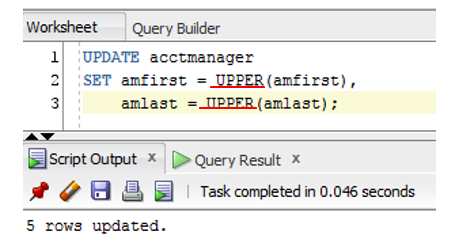
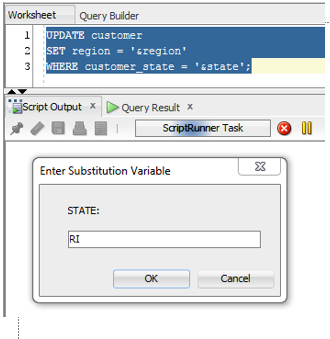

# Modify Data

[Back](../index.md)

- [Modify Data](#modify-data)
  - [UPDATE](#update)
    - [Built-in Function](#built-in-function)
    - [Substitution Variables](#substitution-variables)

---

## UPDATE

- The `UPDATE` statement is used to modify the **existing records** in a table.

- Syntax

```SQL
UPDATE table_name
SET column1 = value1, column2 = value2, ...
WHERE condition;

```

- The `SET` clause is used to **identify** the <u>column</u> to be changed and the <u>new value</u> to be assigned to it. SET 语句用于指定新的值.

- More than one column and value can be specified, **separated by commas**. 使用逗号分隔列.

- Be careful when updating records in a table! Notice the `WHERE` clause in the `UPDATE` statement. The `WHERE` clause specifies which record(s) that should be updated. <u>If you omit the `WHERE` clause, **all** records in the table will be updated!</u>

- 注意: set 中的列名和 where 中的列名可以相同.此时先执行 where,再执行 set.即替换原来的值.

### Built-in Function

使用内置函数更新值.


### Substitution Variables

- A **substitution variable** in a SQL command instructs Oracle to use a substituted value **in place of** the <u>variable</u> when command is executed. 用于代替命令中的变量. <br>适用场景:大量重复命令.如 update

- To include a substitution variable in a SQL command, **use the ampersand (`&`)** followed by the name to be used for the variable. 使用`&`开头来引用.
  This value will **be substituted** with <u>actual data</u> when the command is executed

- 相当于命令行是脚本,并以对话框输入的值作为参数执行具体命令.



---

[Top](#modify-data)

[Back](../index.md)
