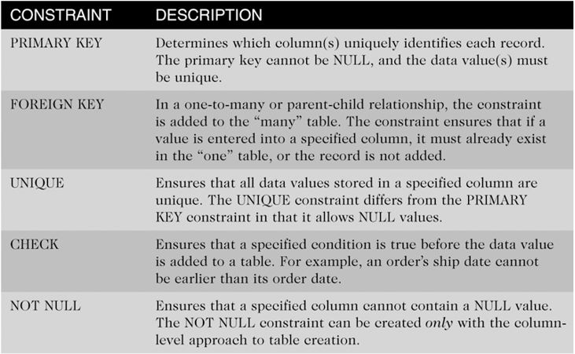

[Back](../index.md)

# Constraint 约束

[TOC]

---

## Constraint

- Constraints are **rules** used to enforce business rules, practices and policies

- Constraints can ensure the **accuracy** and **integrity of data** by **preventing errors** from being entered into a database. <br> If there is any violation between the constraint and the data action, the action is aborted.

## Types of constraint

The following constraints are commonly used in SQL:

- `NOT NULL` - Ensures that a column cannot have a NULL value
- `UNIQUE` - Ensures that all values in a column are different
- `PRIMARY KEY` - A combination of a NOT NULL and UNIQUE. Uniquely identifies each row in a table
- `FOREIGN KEY` - Prevents actions that would destroy links between tables
- `CHECK` - Ensures that the values in a column satisfies a specific condition
- `DEFAULT` - Sets a default value for a column if no value is specified
- `CREATE INDEX` - Used to create and retrieve data from the database very quickly



## Nane of cosntraint

- When creating a constraint you have two options:

  - **Name the constraint** using the same rules as for naming tables and columns
  - Omit the constraint name and allow **Oracle 10g** to generate a name for the constraint<br>
    If Oracle 11g server names the constraint, it will follow the format of `SYS_Cn` where n is a unique numeric value assigned to make the name unique.

- It is always good practice to **provide your own name** for a constraint<br>
  It will allow you to identify it easily in the future

- **Industry convention** for creating a constraint name is:<br>
  `tablename_columnname_constrainttype`

- The **constraint type** is an abbreviation to identify the type of constraint as shown on the next slide

| Constraint    | Abbreviation |
| ------------- | ------------ |
| `PRIMARY KEY` | `_pk`         |
| `FOREIGN KEY` | `_fk`         |
| `UNIQUE`      | `_uk`         |
| `CHENK`       | `_ck`         |
| `NOT NULL`    | `_nn`         |

---

## Create the Constraint

- Constraints can be column level or table level.
  - **Column level constraints** apply to a column.
  - **Table level constraints** apply to the whole table.


- The two **differences** in the syntax of a column-level constraint and a table-level constraint are that **the column name** for a table-level constraint is :<br>两个的区别在于列名位置
  - At the end of the constraint definition rather than at the beginning<br>列层面=行头; 表层面=行尾

### Column level

- When you create constraints at the column level, the constraint being created **applies to the specific column**<br>只作用于指定列

- The optional `CONSTRAINT` keyword is used if you want to give the constraint a specific name

- The **constraint type** uses the uses the following keywords to identify the type of constraint being created:
    - `PRIMARY KEY`
    - `FOREIGN KEY`
    - `UNIQUE`
    - `CHECK`
    - `NOT NULL`

- If the constraint applies to **more than one column**, the constraint must be created at the table level<br>同一个约束在列层面只能指定适用一个列。如果要适用于多个列，则要在表层面创建.

- The `NOT NULL` constraint can **only** be created at the **column level**.<br>not null只能在列层面创建。

- Syntax:

```SQL
-- 中括号表示约束名可选。
columnname [CONSTRAINT constraintname] constrainttype,

```

### Table Level

- The constraint definition is separate from the column definitions. It is listed after all the columns definitions<br>约束定义置于列定义后

- NOT NULL不适用table level

- Composite primary key 只能适用于table level

```SQL
-- 
[CONSTRAINT constraintname] constrainttype (columnname, ...),

```

---

## Disabling and Enabling Constraints

- If a constraint exists for a column, every time an entry is made to that column, it must be evaluated to **determine whether** the value to be entered in the column **violates the constraint** or not

- If a **large block** of data is added to a table, the validation process can severely slow down the Oracle Server’s processing speed. If you are certain that the data being added adheres to the constraints, you can **disable the constraints** before you add the block of data to the table<br>大数据输入时会每行检查所以会拖慢操作.如果确定不违反约束，则可以将约束失效。

```sql
-- disable cosntraints
ALTER TABLE tablemane
DISABLE CONSTRAINT constraintname;

-- enable cosntraints
ALTER TABLE tablemane
ENABLE CONSTRAINT constraintname;

```

---

## Best Practices

- A `NOT NULL` constraint should not be assigned to a `PRIMARY KEY` column, it is a common error to do so, you will not receive an error but you are **duplicating** processing, so refrain from doing this<br> NOT NULL不与PRIMARY KEY同时使用

- A `PRIMARY KEY` enforces both `NOT NULL` and `UNIQUE` constraints

- `CHECK`, `FOREIGN KRY` and `UNIQUE` do allow `NULL` values to be inserted, a `NOT NULL` constraint must be used along with these constraints if you require a value to be inputted to the column<br>允许null， 如果非null，必须明示定义

- If you assign a `DEFAULT` value to a column a `NOT NULL` constraint should not be used, since if no value is assigned the `DEFAULT` value is assigned<br>默认值即有值，则不需要NN


[TOP](#constraint-约束)
