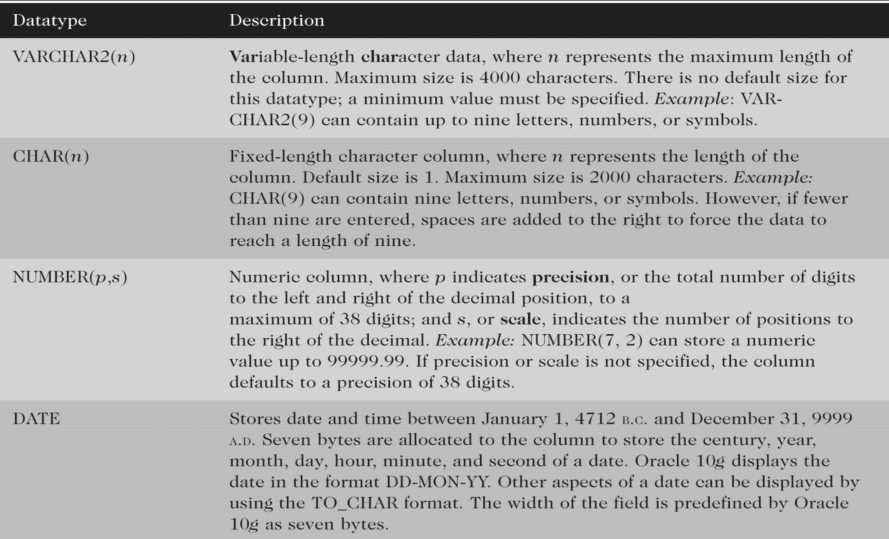

[Back](../index.md)

[TOC]

---

# Column

You must define each of the columns for a table
- Choose a **name** for each column
- Determine the **type** of data to store in each column
- Determine in some case the **maximum width** of a column

## Column Name

- Rules
    - Names of tables and columns can be **up to 30 characters in length**
    - Must **begin with a letter** A – Z or a – z
    - May also include **numbers**, the **underscore (_) character** and the **# sign** is table and column names
    - **No blank spaces** are permitted in a table or column name
    - Each table owned by a user will have a **unique table name** and the **column names** within should also be **unique to that table** (different users can have tables with the same names as yours)
    - In Oracle **reserved words** like, SELECT, DISTINCT, CHAR or NUMBER cannot be used for names

---

## Data Type

## Design A Table

- 3 things related to columns for a table:
    - name
    - data type
    - width

### Naming Conventions for Columns and Tables

- **Length**: Name of tables and columns can be up to 30 characters in length.

- **Initial**: begin with a letter, A-Z or a-z.

- **Special characters**: may include **numbers**, **`_`**, and **`#`**.

- **Blank spaces**: No blank spaces are permitted.

- **Uniqueness**: 
    - unique table name for a user
    - unique column name for a table

- **Reverved words**

---

### Datatypes

---
