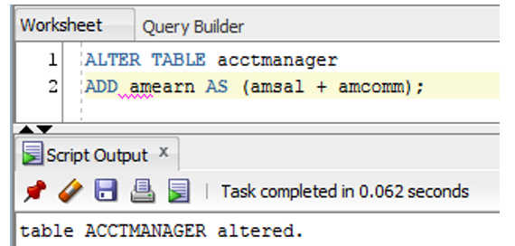

# Design A Table

[Back](../index.md)

- [Design A Table](#design-a-table)
  - [Column](#column)
    - [Column Name](#column-name)
  - [Naming Conventions for Columns and Tables](#naming-conventions-for-columns-and-tables)
  - [Virtual Columns 虚拟列](#virtual-columns-虚拟列)

---

## Column

You must define each of the columns for a table

- Choose a **name** for each column
- Determine the **type** of data to store in each column
- Determine in some case the **maximum width** of a column

---

### Column Name

- Rules
  - Names of tables and columns can be **up to 30 characters in length**
  - Must **begin with a letter** A – Z or a – z
  - May also include **numbers**, the **underscore (\_) character** and the **# sign** is table and column names
  - **No blank spaces** are permitted in a table or column name
  - Each table owned by a user will have a **unique table name** and the **column names** within should also be **unique to that table** (different users can have tables with the same names as yours)
  - In Oracle **reserved words** like, SELECT, DISTINCT, CHAR or NUMBER cannot be used for names

---

## Naming Conventions for Columns and Tables

- **Length**: Name of tables and columns can be up to 30 characters in length.

- **Initial**: begin with a letter, A-Z or a-z.

- **Special characters**: may include **numbers**, **`_`**, and **`#`**.

- **Blank spaces**: No blank spaces are permitted.

- **Uniqueness**:

  - unique table name for a user
  - unique column name for a table

- **Reverved words**

---

## Virtual Columns 虚拟列

- A **virtual column** is a column that the value is generated based on the values of other columns. 虚拟列的值是基于其他列的值. In other words the database system generates the value for the column automatically based on the <u>manipulation</u> or a <u>calculation</u> defined for the column

- Add Virtual Columns 添加虚拟列

- amearn 列是基于 amsal 和 amcomm 的和.
- 添加后,amearn 的值会自动根据 amsal 和 amcomm 的值计算.

---

[TOP](#design-a-table)
