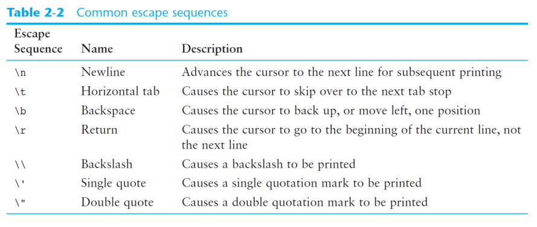

[Back to Java](../index.md)

[TOC]

***

# System Class

## System.out

- The console window that starts a Java application is typically known as the **standard output device**.
    console window = standard output device
- The **standard input device** is typically the keyboard.
    keyboard = standard input device
- The **standard Java library**, which a Java class is used to send information to the standard output device, is commonly referred to as the **Java API**
    std Java library = Java API = 用于输入输出
&emsp;

- 代码解释: `System.out.println("");`
    - The `System` class is called from the standard Java library.
    - The `System` class contains methods and objects that perform system level tasks.
    - The `out` object, a member of the `System` class, contains the methods `print` and `println`.
    - The `println` method places a **newline character** at the end of whatever is being printed out. 在最后放置一个换行号
    - By contrast, the `print` statement does not put a newline character at the end of the output.
    - The value inside the parenthesis, called an **argument**参数, will be sent to the output device (in this case, a string).

## Escape Sequences 转义序列

- **Escape sequences** allow the programmer to print characters that otherwise would be unprintable.
    能打印或显示本来不能被打印的字符

- The `\n` in the string is an **escape sequence**that represents the **newline character**

