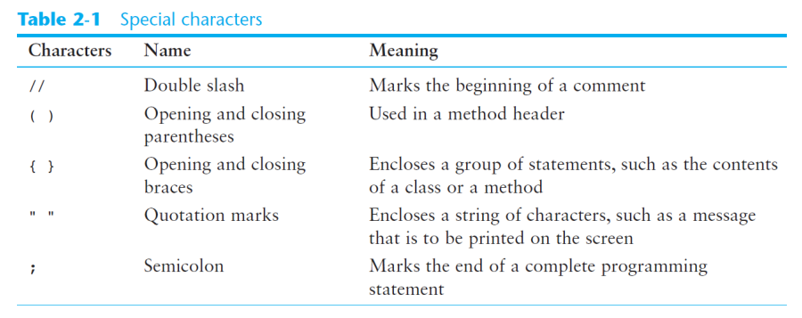

[Back to Java](../index.md)

[TOC]

---

# Java

## Java File Java文件

- All Java programs must be stored in a file with a `.java` file extension.
  必须存放在以`.java`为扩展名的文件内。


## Java Language

- case-sensitive

- Comments are ignored by the compiler. 忽略注释。
- A `.java` file may contain many classes but may **only have one public class**.
  一个`.java`文件可以定义多个类，但只能有一个 public 类。
- If a .java file has a public class, the class must have the same name as the file.
  public 类名=文件名
- Java applications must have a main method.
  程序必须有一个 main 方法
- Statements are terminated with semicolons, but **comments**, **class headers**, **method headers**, and **braces** are not.
  那些不需要分号结束



---

## Parts of a Java Program

```java

// comment
// Blank line
public class Simple     //Class Header, marks the beginning of a class definition
{       // opening brace
// CLass body
    public static void main(String[] args)      //Method header
    {       //Method body
        System.out.println("Hello world!");    // Statement
    }
}       // Closing brace

```

- `Comment`:

  - begin with double slash
  - The compiler ignores everything from the double slash to the end of the line. 编译器会忽略
  - help **explain** what is going on in the program.

- `Blank Line`: improve readability
- `Class Header`
  - marks the beginning of a class definition
  - tells the compiler that a publicly accessible class named Simple **is being defined**.
  - **A Java program must have at least one class definition.**
    一个程序包含至少一个类定义
- `Class body`:
  - Everything between the opening brace and closing brace is the body of the class named Simple.
- `Method header`:
  - marks the beginning of a method.
  - **Every Java application must have a method named main.**
    Java 程序有且只有一个 main
  - The main method is the **starting point** of the application.
- `Method body`:

  - Everything between the two braces is the **body** of the main method.
  - Make sure to have a closing brace for every opening brace in your program.

- `Satement`:
  - **A semicolon at the end of the line marks the end of a statement in Java**. 以分号结束
  - Not every line of code ends with a semicolon. 但不是所有行都需要分号结束.只有那些提交执行的 instruction 才要。
  - The **group of characters** inside the **quotation marks** is called a **string literal**字符串字面值.
    引号内的一组字符=字符串字面值

---

## Operator

- The + operator can be used in two ways.
  - as a concatenation operator 字符串连接符
  - as an addition operator 加法计算符

A string literal value cannot span lines in a Java source code file. The String concatenation operator can be used to fix this problem.
字符串不能跨行，因此加号能解决该问题。

e.g.:

```java

System.out.println("These lines are " +
                    "now ok and will not " +
                    "cause the error as before."
                    );

// The Concatenation operator can be used to format complex String objects.
// 用于处理复杂格式输出

System.out.println("The following will be printed " +
                    "in a tabbed format: " +
                    "\n\tFirst = " + 5 * 6 + ", " +
                    "\n\tSecond = " + (6 + 4) + "," +
                    "\n\tThird = " + 16.7 + "."
                    ); 

```
