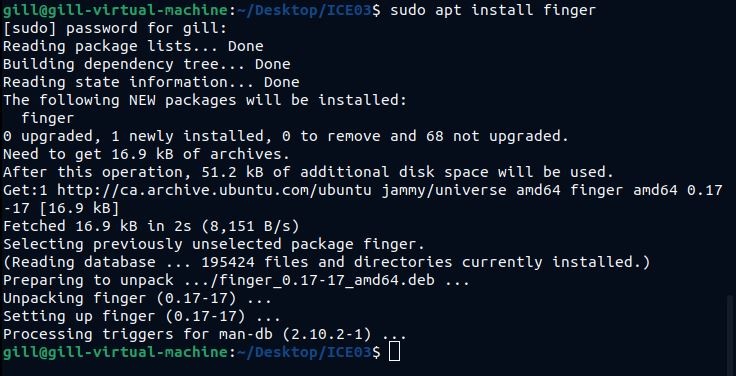
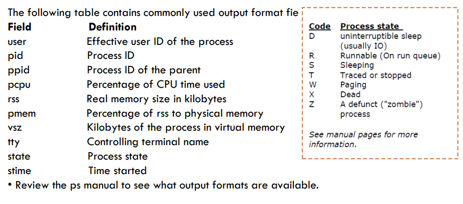

# System Management 系统管理

[back to OS](../index.md)

[TOC]

---

## Account Management

### who

- To show who is logged in
    Print information about users who are currently logged in.
    将会以 list 返回，并以 NAME, LINE, TIME, COMMENT 的列名显示

- Linux who 命令用于显示系统中有哪些使用者正在上面，显示的资料包含了使用者 ID、使用的终端机、从哪边连上来的、上线时间、呆滞时间、CPU 使用量、动作等等。

- 使用权限：所有使用者都可使用。

| Command & Option | Description                                                            |
| ---------------- | ---------------------------------------------------------------------- |
| `who`            | To return a list of current users  返回当前活动的用户               |
| `who -H`         | To return a list of current users with headings  返回当前活动的用户 |

---

### finger

To displays detailed information about the system users who are logged on the system. 查询一些其他使用者的资料。

- 需要安装: `$sudo apt install finger`

- `Return`: multicolumn 多列

  - `Login`: shows the **login name** of the users.
  - `Name`: shows the **full name** of the users.
  - `TTY`: shows the **device number** of the users' terminals.
    - `*`: The `*` before the terminal name indicates that sending messages to that terminal is blocked.
  - `Idle`: shows **the elapsed time(经过时间)** since each user last typed on the keyboard.
  - `When`: shows the time that each user logged in.
  - `Where`: shows the addresses of the user' terminals.

- `Argument`: username

| Command & Option  | Description                                                                                                               |
| ----------------- | ------------------------------------------------------------------------------------------------------------------------- |
| `finger`          | To return an entry for each user currently logged into the system  返回当前活动的用户                                  |
| `finger username` | To return information about the specified user, regardless of whethter the user is logged in or not.  返回指定用户信息 |
| `finger -l`       | To return a **multi-line** format displaying all of the information  以多行显示用户信息                                |
| `finger -s`       | To return a **single-line** format of information  以多行显示用户信息                                                  |

## `whoami`

- print effective current user id 返回当前用户名

---

## Process Management

### `echo $$ $PPID`

To display the **current process ID** and **PPID**.

### `pidoff`

To find the process ID of a running program.

- **Option**:

| Command & Option | Description                    |
| ---------------- | ------------------------------ |
| `pidof command`  | To return the PID of a command |

|

### `pgrep`

To look through the currently running processes and list the process IDs, based on command name. 根据命令名返回 PID.

- **Option**:

| Command & Option   | Description                                                         |
| ------------------ | ------------------------------------------------------------------- |
| `pgrep command`    | To list process ID of a given command name                          |
| `pgrep -l command` | To list **process ID** and **command name** of a given command name |

---

### `ps`: process status

- To displays information about a selection of the active processes running in the current shell.命令用于显示当前进程的状态，类似于 windows 的任务管理器。

- **Display Format**: 显示的列

  - `USER`: user running the process
  - `%CPU`: the percentage of the CPU the process has been using over the past minute,
  - `%MEN`: the percentage of the real memory,
  - `VSZ`: the virtual memory size in kilobytes,
  - `RSS`: the physical memory used,
  - `START`: when the process was started,
  - `COMMAND`: the command name.
  - `UID`: user ID
  - `PID`: process ID
  - `PPID`: parent process ID
  - `PGID`: process group ID
  - `SGID`: saved group ID
  - `TPGID`: ID of the foreground process group on the terminal that the process is connected to, or `-1` if the process is not connected to a tty.
  - `STAT`: process state.
  - `C`: cpu utilization
  - `STIME`: 行程开始时间
  - `TTY`: the terminal it is connected to. (the device number of the controlling tty) 终端的次要装置号码 (minor device number of tty)
    - `?`: 该值表示是`Daemon`后台程序.
  - `TIME`: cumulative CPU time, the CPU time used by process since it started 执行的时间
  - `CMD`: simple name of executable.
     

    

- **`STAT`**: 该行程的状态:

  - `D`: uninterruptible sleep (usually IO) 无法中断的休眠状态 (通常 IO 的进程)
  - `I`: Idle kernel thread
  - `R`: **Runnable** running or runnable (on run queue) 正在执行中
  - `S`: **Sleeping** interruptible sleep (waiting for an event to complete) 静止状态
  - `T`: **Stopped/Traced** stopped by job control signal 暂停执行
  - `t`: stopped by debugger during the tracting
  - `Z`: 不存在但暂时无法消除
  - `W`: paging ()没有足够的记忆体分页可分配
  - `X`: **Dead** dead (should never be seen)
  - `Z`: **Zombie** defunct ("zombie") process, terminated but not reaped by its parent. 僵尸进程
  - `<`: high-priority (not nice to other users) 高优先序的行程
  - `N`: low-priority (nice to other users) 低优先序的行程
  - `L`: has pages locked into memory (for real-time and custom IO)有记忆体分页分配并锁在记忆体内 (实时系统或捱 A I/O)
     

- **Option**:

| Command & Option   | Description                                                                                                                  |
| ------------------ | ---------------------------------------------------------------------------------------------------------------------------- |
| `ps`               | To report a snapshot of the current processes.进程快照,简单显示当前进程.                                                     |
| `ps -a`            | To report a snapshot of all current processes.简单显示所有当前进程.                                                          |
| `ps -ef`           | To return every process on the system.                                                                                       |
| `ps -xj`           | To return process on the system in a job format with BSD-style.                                                              |
| `ps -u`            | To select and display current user's processes .                                                                             |
| `ps -o pid,s,comm` | To display the current processes in user-defined format.                                                                     |
| `ps -C command`    | To display information about a given command name.                                                                           |
| `ps fx`            | To display the tree like structure of all processes, including hierarchy of parent and related child processes. 显示层级关系 |

`ps p PID`:To select information by process ID.

---

### `w`

- `$w`: To display the information about the users and their processes.

---

### `kill`

- To send a signal to process.

  - A signal is a special value that can be sent to and from a command.
     

- **Option**:

| Command & Option | Description                                                         |
| ---------------- | ------------------------------------------------------------------- |
| `kill [pid]`     | To terminate processes with a list of pid                           |
| `kill -9 [pid]`  | To terminate processes permanently (**sure kill**).彻底杀死一个进程 |
| `kill -l`        | To list signal names.                                               |

### `pkill`

To send the specified signal to each process, based on command name.

- **Option**:

| Command & Option | Description                                  |
| ---------------- | -------------------------------------------- |
| `pkill command`  | To terminate processes based on command name |

### `killall`

To send a signal to each process by name.

- **Option**:

| Command & Option     | Description                                             |
| -------------------- | ------------------------------------------------------- |
| `killall command`    | To terminate processes based on command name            |
| `killall -9 command` | To terminate processes completely based on command name |

---

### `exit`

- To exit the current shell. 用于退出目前的 shell。 exit 也可用在 script，离开正在执行的 script，回到 shell。

- **Option**:

| Command & Option | Description                           |
| ---------------- | ------------------------------------- |
| `exit`           | To exit the current shell.            |
| `exit PID`       | To exit the shell with specified PID. |

---

### `top`

- To display Linux processes. To list the consumption of resources 实时显示 process 的动态。
    provides a dynamic real-time view of a running system. It can display system summary information and a list of processes or threads currently being managed by the Linux kernel.
   

- To terminate: `Ctrl + C`

- **Option**:

| Command & Option | Description                                                                   |
| ---------------- | ----------------------------------------------------------------------------- |
| `top`            | To list resource consumption of all processes and an overview of information. |
| `top -p [PID]`   | To monitor the resouce consumption of processes with specified process IDs.   |

---

### `jobs`

- To display processes running in the background of the currently shell.
    By default you will not have any jobs running in background.

- **Option**:

| Command & Option | Description                                 |
| ---------------- | ------------------------------------------- |
| `jobs`           | To display processes running in background. |

### `fg`

- To bring a background job to the foreground. 唤起后台进程到前台.

- **Parameter**: The number of the background job to bring forward is the parameter of `fg`. 在`jobs`中的序号.

- **Option**:

| Command & Option | Description                                           |
| ---------------- | ----------------------------------------------------- |
| `fg NUM`         | To bring the NUM job in background to the foreground. |

---

[TOP](#system-management-系统管理)
