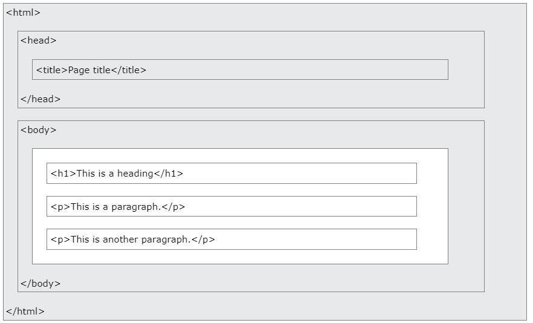

[Back to Course Page](/ITC-5103_Web_Programming_and_Design/html/html_index.md)

[TOC]

---

# HTML

## Two types of pages

1. Static pages

   - The content in pages cant be changed;
   - Everyone see same content
     &emsp;

2. Dynamic pages
   - The content are connected to the database which return different data
     e.g.: hotel.com different people have different contents.
     php 不用学, 所以主要学 html, css, js, Jquery
     &emsp;

## IDE: VSC

- Extension: open in browser

---

## HTML File

HTML files end with the extension of `.html`.

- HTML stands for Hyper Text Markup Language
- HTML is the standard markup language for creating Web pages
- HTML describes the structure of a Web page
- HTML consists of a series of elements
- HTML elements tell the browser how to display the content

---

## HTML Page Structure

```html

<!-- All HTML documents must start with a document type declaration that represents the document type, and helps browsers to display web pages correctly. -->
<!-- It must only appear once, at the top of the page (before any HTML tags). -->
<!-- not case sensitive -->
<!DOCTYPE html>

<!-- The HTML document itself begins with <html> and ends with </html>. It is the root element of an HTML page -->
<html>

    <!-- The element contains meta information about the HTML page -->
  <head>
    <!-- element specifies a title for the HTML page -->
    <title>Page Title</title>
  </head>
  <!-- The visible part of the HTML document is between <body> and </body>. -->
  <body>
    <!-- element defines a large heading -->
    <h1>My First Heading</h1>
    <!-- element defines a paragraph -->
    <p>My first paragraph.</p>
  </body>
</html>

```




---

## HTML Element

An HTML element is defined by **a start tag**, some content, and **an end tag**.


